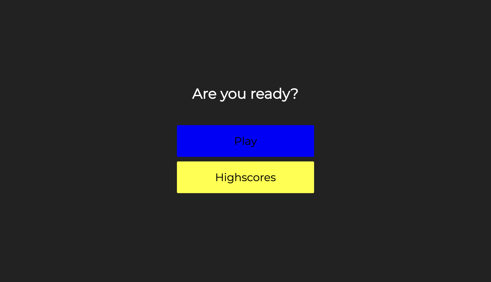
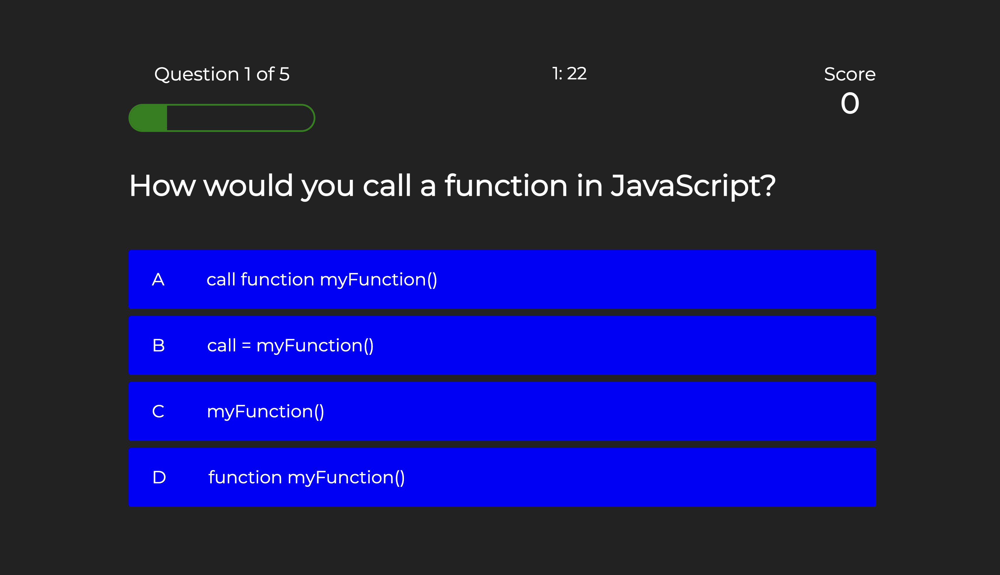
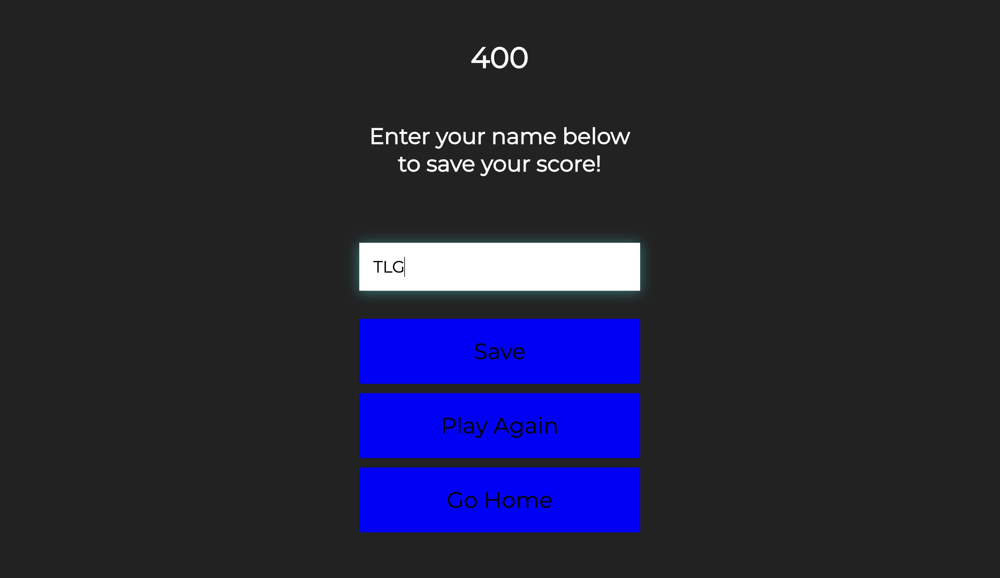
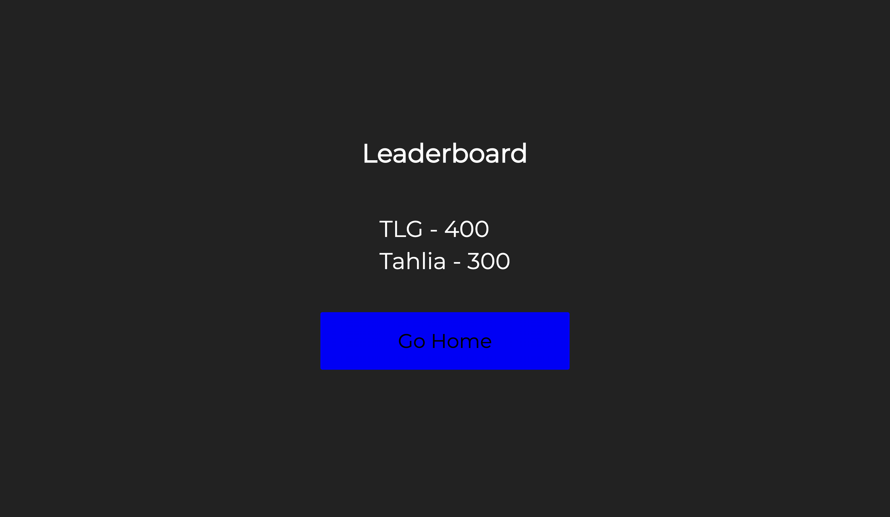

# Code Quiz

## Project Background
An application that enables users to test their knowledge of JavaScript through a timed quiz that that records scores so  that users can gauge their progress compared to others.

## Course of Action
- Initial landing page with a button to start the game or view high scores.
- Click start button to initialise quiz where the timer is activated and first question appears.
- Green indicates correct choice of answer and red indicates incorrect choice of answer with 15 seconds deducted.
- Check boxes to include lowercase letters, uppercase letters, numbers and symbols.
- Game ends when all questions are answered or timer runs out.
- Input initials and save score when finished quiz.

## Git Hub Repository
The link takes you to the repository where the portfolio is hosted.
https://github.com/tahlialg/code-quiz

## Deployed Application
The link showcases the deployed code quiz.
https://tahlialg.github.io/code-quiz/

